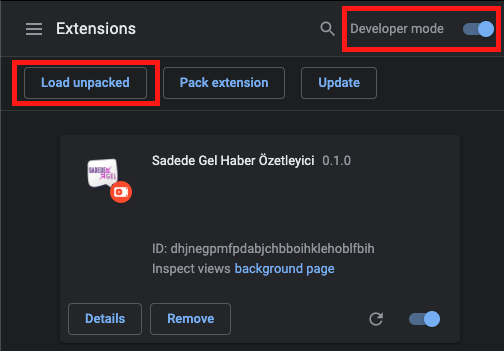

<a href="http://sadedegel.ai"></a>

# SadedeGel Chrome Extension

SadedeGel Chrome Extension is a handy usage of SadedeGel library. Developed as a part of [Açık Kaynak Hackathon Programı 2020](https://www.acikhack.com/).

Supported news websites:
* [hurriyet.com.tr](https://www.hurriyet.com.tr/)
* [milliyet.com.tr](https://www.milliyet.com.tr/)
* [sozcu.com.tr](https://www.sozcu.com.tr/)
* [haberturk.com](https://haberturk.com/)
* [sabah.com.tr](https://www.sabah.com.tr/)

Please check [SadedeGel](https://github.com/GlobalMaksimum/sadedegel) repository for more information.

[](https://github.com/GlobalMaksimum/sadedegel-chrome-extension/blob/master/LICENSE)


## 💬 Where to ask questions

The SadedeGel project is maintained by [@globalmaksmum](https://github.com/GlobalMaksimum) AI team members
[@dafajon](https://github.com/dafajon),
[@askarbozcan](https://github.com/askarbozcan),
[@mccakir](https://github.com/mccakir) and 
[@husnusensoy](https://github.com/husnusensoy). 

| Type                     | Platforms                                              |
| ------------------------ | ------------------------------------------------------ |
| 🚨 **Bug Reports**       | [GitHub Issue Tracker]                                 |
| 🎁 **Feature Requests**  | [GitHub Issue Tracker]                                 |

[github issue tracker]: https://github.com/GlobalMaksimum/sadedegel-chrome-extension/issues

## Installation

1. Clone or download the project. 
2. Open the Extension Management page by navigating to <b>chrome://extensions</b>. 
3. Enable Developer Mode by clicking the toggle switch next to <b>Developer mode</b>. 
4. Click the <b>Load unpacked</b> button and select the extension directory. 

 

5. Install <b>[SadedeGel](https://github.com/GlobalMaksimum/sadedegel)</b> 
```bash 
pip install sadedegel
``` 
6. Run Sadedegel summarizer server
```bash
python3 -m sadedegel.server 
```


## Usage
Click the extension icon on news website's article page.

Extension pops up a modal and allows you to modify certain options.


